# Ανίχνευση Συναισθημάτων σε Ηχητικά Δεδομένα

---

## 1. Σκοπός και Στόχοι

Η παρούσα εργασία ασχολείται με αναγνώριση συναισθήματος *(Speech Emotion Recognition)* βασισμένη σε ηχητικά δεδομένα και κλασικά μοντέλα μηχανικής μάθησης. Το κύριο dataset είναι το IEMOCAP *(Interactive Emotional Dyadic Motion Capture)*, ένα ευρέως χρησιμοποιούμενο corpus για έρευνα στη συναισθηματική ανάλυση ομιλίας.

**Στόχος:** Ταξινόμηση ομιλίας σε 4 κλάσεις συναισθήματος — *θυμός (angry)*, *χαρά (happy)*, *ουδέτερο συναίσθημα (neutral)*, *λύπη (sad)* — χρησιμοποιώντας pipeline προεπεξεργασίας, εξαγωγής χαρακτηριστικών και εκπαίδευσης/αξιολόγησης πολλαπλών ταξινομητών.

---

## 2. Τεχνολογίες και Εργαλεία

Το project είναι καθαρά **Python-based** και βασίζεται σε βιβλιοθήκες ML και ήχου:

| Κατηγορία | Τεχνολογία |
|-----------|------------|
| **ML / Ταξινόμηση** | scikit-learn, XGBoost |
| **Βελτιστοποίηση υπερπαραμέτρων** | Optuna (μέσω RandomizedSearchCV) |
| **Ήχος / Σήμα** | librosa, soundfile, pyAudioAnalysis |
| **Δεδομένα** | pandas, numpy |
| **Οπτικοποίηση** | matplotlib, seaborn |

Η βασική αρχιτεκτονική αποτελείται από python scripts (π.χ. `01_preprocess_data.py` → `08_one_shot_predict_eval.py`) τα οποία περιέχουν όλη τη λειτουργικότητα και χρησιμοποιούνται στα workflows - pipelines για την υλοποίηση τριών πειραμάτων (βλ. [Ενότητα 5](#5-δομή-pipeline-και-workflows)).

---

## 3. Δεδομένα

### 3.1 IEMOCAP

- **Πηγή:** IEMOCAP (metadata σε `iemocap_full_dataset.csv`, αρχεία ήχου οργανωμένα σε sessions).
- **Ετικέτες:** `Angry`, `Happy`, `Neutral`, `Sad`. Οι κατηγορίες Happy και Excited του αρχικού dataset συνενώθηκαν σε μία τελική κατηγορία `Happy`. Τα υπόλοιπα labels του dataset (fea, dis, fru, sur, oth, xxx) απορρίφθηκαν.
- **Μετά την προεπεξεργασία:**
  - **5.531 δείγματα** (από 10.039 metadata).
  - **272 χαρακτηριστικά** ανά δείγμα (68 βασικά × 4 στατιστικά: mean, min, max, std).

**Κατανομή κλάσεων:**

| Κλάση   | Πλήθος | Ποσοστό |
|---------|--------|--------|
| neutral | 1.708  | 30,9%  |
| happy   | 1.636  | 29,6%  |
| angry   | 1.103  | 19,9%  |
| sad     | 1.084  | 19,6%  |

**Εξαγωγή χαρακτηριστικών:** 

Για την εξαγωγή των χαρακτηριστικών χρησιμοποιήθηκε η βιβλιοθήκη pyAudioAnalysis με παράθυρο 50 ms και βήμα 25 ms. Η διαδικασία ξεκινά με την κατάτμηση του σήματος σε χρονικά παράθυρα (frames), στα οποία υπολογίζονται χαρακτηριστικά τόσο στο χρονικό πεδίο (π.χ. Zero Crossing Rate, ενέργεια) όσο και στο φασματικό μέσω του μετασχηματισμού Fourier (π.χ. spectral centroid, spread, entropy, flux, MFCCs και chroma). Επιπλέον, εξάγονται τα χαρακτηριστικα για την αποτύπωση του ρυθμού μεταβολής των παραπάνω μεγεθών. Τέλος, οι τιμές των χαρακτηριστικών συνοψίζονται ανά αρχείο ομιλίας μέσω στατιστικών δεικτών (μέση τιμή, ελάχιστο, μέγιστο και τυπική απόκλιση), καταλήγοντας σε ένα τελικό διάνυσμα 272 διαστάσεων ανά δείγμα.

### 3.2 CREMA-D

Στο project χρησιμοποιείται και ένα δεύτερο dataset, το CREMA-D για zero-shot αξιολόγηση. Συγκεκριμένα, αφού τα μοντέλα εκπαιδευτούν στο IEMOCAP αξιολογούνται στο CREMA-D, ώστε να ελεγχθεί η γενίκευση που επιτυγχάνουν.

Εφαρμόζεται η ίδια διαδικασία προεπεξεργασίας και εξαγωγής χαρακτηριστικών όπως στο IEMOCAP (pyAudioAnalysis, παράθυρο 50 ms, βήμα 25 ms, 68 βασικά χαρακτηριστικά × 4 στατιστικά → 272 διαστάσεων ανά δείγμα). Τα δεδομένα βρίσκονται στο φάκελο `cremad_zero_shot_dataset/` (αρχεία `cremad_features.csv`, `cremad_feature_report.txt`).

- **Μετά την προεπεξεργασία:** Απέμειναν 4.900 δείγματα (απορρίφθηκαν 2.542 από τα 7.442).
- **Ετικέτες:** Οι ίδιες 4 κλάσεις — `angry`, `happy`, `neutral`, `sad`.

**Κατανομή κλάσεων (CREMA-D):**

| Κλάση   | Πλήθος | Ποσοστό |
|---------|--------|--------|
| angry   | 1.271  | 25,9%  |
| happy   | 1.271  | 25,9%  |
| sad     | 1.271  | 25,9%  |
| neutral | 1.087  | 22,2%  |

---

## 4. Μετρικές Αξιολόγησης

Για την αξιολόγηση της ταξινόμησης συναισθημάτων χρησιμοποιήθηκαν οι μετρικές Accuracy, Precision (weighted), Recall (weighted), F1-score (weighted), F1-score (macro) και UAR. Για σύγκριση μεταξύ workflows υπολογίστηκε επίσης το Macro AUC (one-vs-rest) και παρουσιάζονται οι αντίστοιχες ROC καμπύλες (macro-averaged ανά workflow).

---

## 5. Δομή Pipeline και Workflows

Η αρχιτεκτονική του project είναι modular: κάθε ροή εργασίας *(workflow)* αξιοποιεί τα κοινά σενάρια επεξεργασίας από τον φάκελο scripts/, ενώ τα αποτελέσματα εξάγονται σε ξεχωριστούς φάκελους (workflows/<workflow_name>/), διασφαλίζοντας την οργάνωση των δεδομένων.

### 5.1 Workflow **IEMOCAP 80-20** (`workflows/iemocap_80_20/`)

1. **Preprocess** — IEMOCAP → εξαγωγή χαρακτηριστικών → `iemocap_features.csv`.
2. **Split** — stratified διαχωρισμός 80-20 (Train 4.424, Test 1.107), κανονικοποίηση *(StandardScaler)* στο train και εφαρμογή στο test· αποθήκευση `scaler.pkl`.
3. **Train** — Εκπαίδευση 7 ταξινομητών (RF, XGB, SVM, KNN, DTR, Logistic Regression, NB).
4. **Evaluate** — Αξιολόγηση με τα ακόλουθα metrics: accuracy, F1, precision, recall, confusion matrix, learning curves.
5. **Hyperparameter tuning** — RandomizedSearchCV (weighted F1), αποθήκευση best params και μοντέλων.
6. **Τελικό Evaluation** — Αξιολόγηση με τα tuned μοντέλα.
7. **Zero-Shot** —  Έλεγχος γενίκευσης του μοντέλου σε εξωτερικά datasets.

### 5.2 Workflow **IEMOCAP PCA** (`workflows/iemocap_pca/`)

1. Preprocess IEMOCAP.
2. Split 80-20 χωρίς κανονικοποίηση.
3. Εφαρμογή **PCA** στο train (threshold αθροιστικού variance 0.99), backup των παλιών train/test σε `*_old.csv`.
4. Train → Evaluate → Tuning → Evaluate.
5. **Zero-Shot** με CREMA-D τα features του zero-shot περνούν από το ίδιο PCA/scaler.

**PCA:** 272 αρχικές διαστάσεις, 205 τελικά components για 99.03% cumulative explained variance (threshold 0.99).

### 5.3 Workflow IEMOCAP LOSO (`workflows/iemocap_loso/`)

- **Leave-One-Speaker-Out:** Διαμερισμός ανά fold κάθε fold αφήνει έξω ένα session για test.
- **5 folds** (fold_0 … fold_4)· ανά fold: train → tuning → evaluate → zero-shot (CREMA-D).
- Τα αποτελέσματα αθροίζονται στο `results/loso_summary.txt`.

---

## 6. Αναλυτική Παρουσίαση Αποτελεσμάτων

Στην ενότητα αυτή παρατίθενται τα αναλυτικά αποτελέσματα για κάθε Workflow.

### 6.1 Αποτελέσματα Workflow 1: IEMOCAP 80-20

Στο βασικό σενάριο χρησιμοποιούνται όλα τα χαρακτηριστικά (272) και stratified διαχωρισμός 80/20.

**Συγκεντρωτικός Πίνακας (Test Set):**

| Μοντέλο | Accuracy | F1 (Weighted) | Precision (Weighted) | Recall (Weighted) | Macro AUC |
| :--- | :---: | :---: | :---: | :---: | :---: |
| XGBoost (XGB) | **0.6224** | **0.6221** | **0.6280** | **0.6224** | **0.8542** |
| SVM | 0.6125 | 0.6125 | 0.6155 | 0.6125 | 0.7185 |
| Logistic Regression | 0.5989 | 0.5983 | 0.5986 | 0.5989 | 0.7914 |
| Random Forest (RF) | 0.5881 | 0.5878 | 0.5949 | 0.5881 | 0.8224 |
| K-Nearest Neighbors (KNN) | 0.5565 | 0.5519 | 0.5588 | 0.5565 | 0.6283 |
| Naive Bayes (NB) | 0.4923 | 0.4780 | 0.4947 | 0.4923 | 0.7513 |
| Decision Tree (DTR) | 0.4688 | 0.4680 | 0.4694 | 0.4688 | 0.7118 |

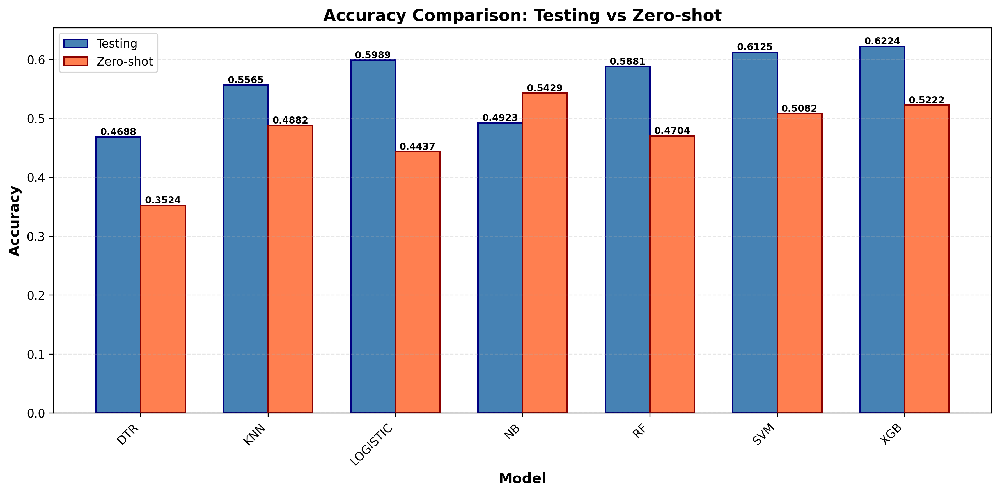

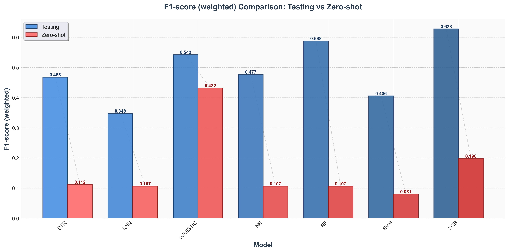

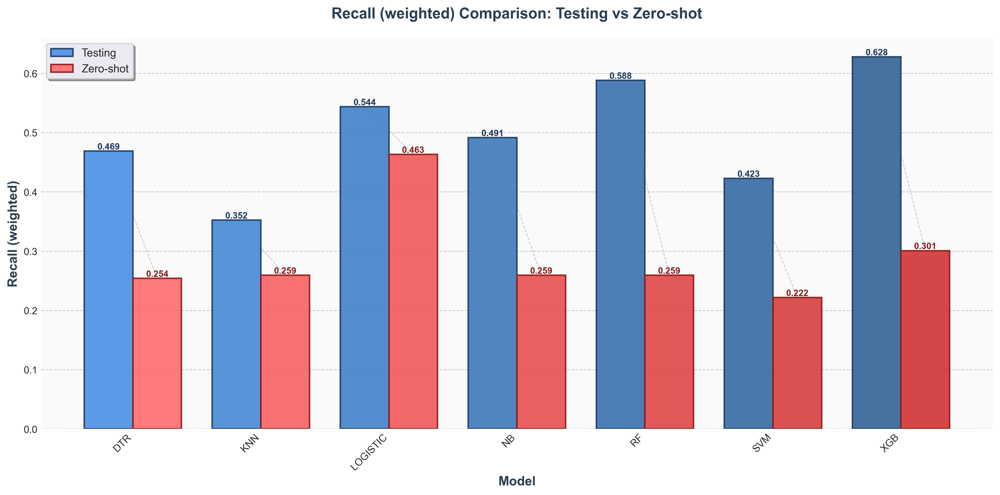

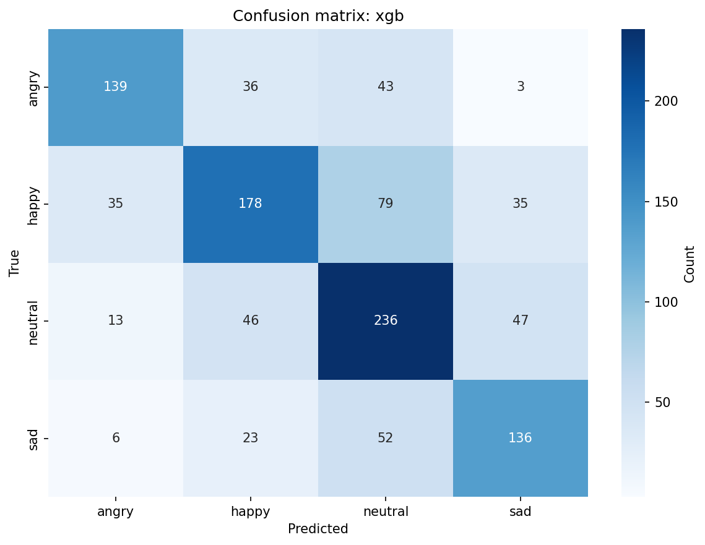

**Ανάλυση ανά Μοντέλο:**
*   **XGBoost: Κορυφαία επίδοση σε Accuracy και Macro AUC.**
*   **SVM: Πολύ κοντά στο XGBoost, με σταθερή απόδοση.**
*   **Logistic Regression: 3η θέση — ισχυρή γραμμική συνιστώσα.**
*   **Random Forest: Ισχυρό αλλά ελαφρώς χαμηλότερο.**
*   **KNN: Μέτρια επίδοση λόγω υψηλής διαστατικότητας.**
*   **Naive Bayes & DTR: Χαμηλότερες επιδόσεις.**

---

---

### 6.2 Αποτελέσματα Workflow 2: IEMOCAP PCA

Εδώ εξετάζουμε την επίδραση της μείωσης διαστάσεων (205 components, 99.03% variance).

**Συγκεντρωτικός Πίνακας:**

| Μοντέλο | Accuracy | F1 (Weighted) | Precision (Weighted) | Recall (Weighted) | Macro AUC |
| :--- | :---: | :---: | :---: | :---: | :---: |
| SVM | **0.6116** | **0.6115** | **0.6142** | **0.6116** | **0.8466** |
| Logistic Regression | 0.5908 | 0.5900 | 0.5905 | 0.5908 | 0.8286 |
| XGBoost (XGB) | 0.5619 | 0.5618 | 0.5641 | 0.5619 | 0.8174 |
| K-Nearest Neighbors (KNN) | 0.5583 | 0.5541 | 0.5603 | 0.5583 | 0.8030 |
| Random Forest (RF) | 0.5519 | 0.5469 | 0.5830 | 0.5519 | 0.8050 |
| Decision Tree (DTR) | 0.4734 | 0.4694 | 0.4761 | 0.4734 | 0.7145 |
| Naive Bayes (NB) | 0.3930 | 0.3814 | 0.4465 | 0.3930 | 0.6587 |

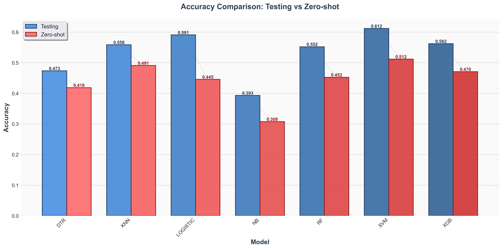

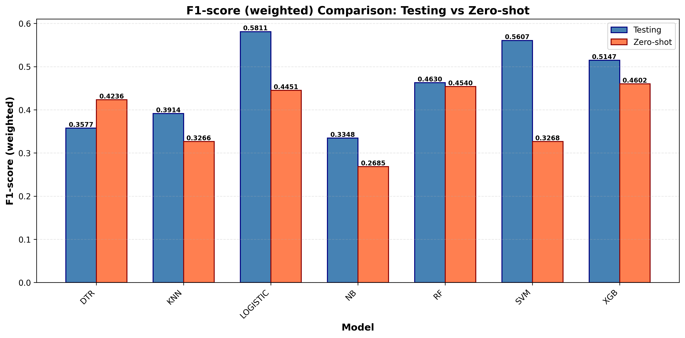

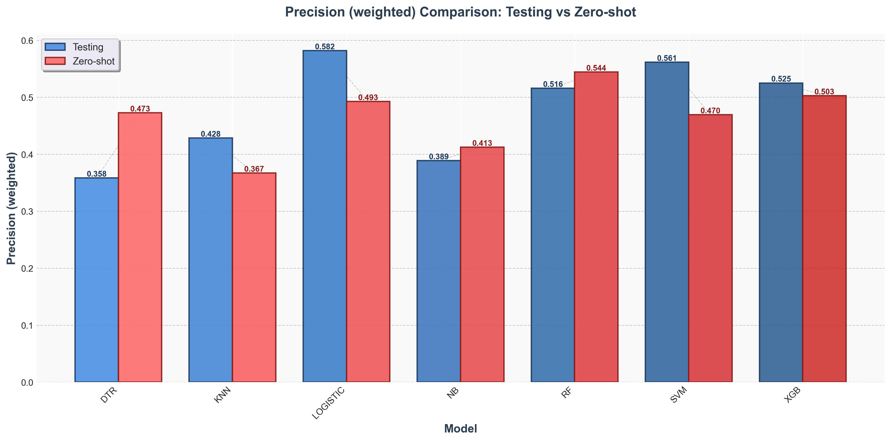

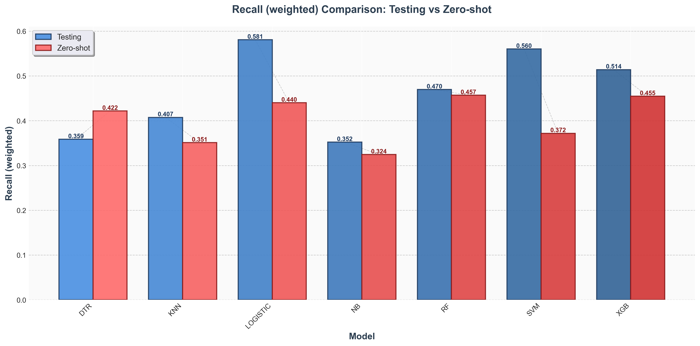

**Ανάλυση ανά Μοντέλο:**
*   **SVM & Logistic Regression: Τα γραμμικά μοντέλα έχουν την καλύτερη απόδοση.**
*   **XGBoost & RF: Παρατηρείται μείωση ~4–6 μονάδων.**
*   **Υπόλοιπα: KNN μέτριο, DTR και NB χαμηλά.**

---

---

### 6.3 Αποτελέσματα Workflow 3: IEMOCAP LOSO

 Μοντέλα δοκιμάζονται σε άγνωστους ομιλητές (Cross-Validation).

**Συγκεντρωτικός Πίνακας (Mean ± Std):**

| Μοντέλο | Accuracy | F1 (Weighted) | Precision (Weighted) | Recall (Weighted) | Macro AUC (mean) |
| :--- | :---: | :---: | :---: | :---: | :---: |
| SVM | **0.5638** | **0.5634** | **0.5801** | **0.5638** | — |
| XGBoost (XGB) | 0.5626 | 0.5613 | 0.5722 | 0.5626 | 0.7375 |
| Random Forest (RF) | 0.5455 | 0.5447 | 0.5653 | 0.5455 | **0.7572** |
| Logistic Regression | 0.5358 | 0.5320 | 0.5420 | 0.5358 | 0.5329 |
| K-Nearest Neighbors (KNN)| 0.5153 | 0.5105 | 0.5298 | 0.5153 | 0.6459 |
| Naive Bayes (NB) | 0.4795 | 0.4637 | 0.4810 | 0.4795 | 0.5117 |
| Decision Tree (DTR) | 0.4367 | 0.4367 | 0.4457 | 0.4367 | 0.6020 |

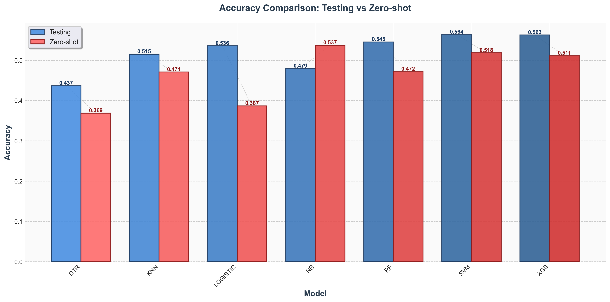

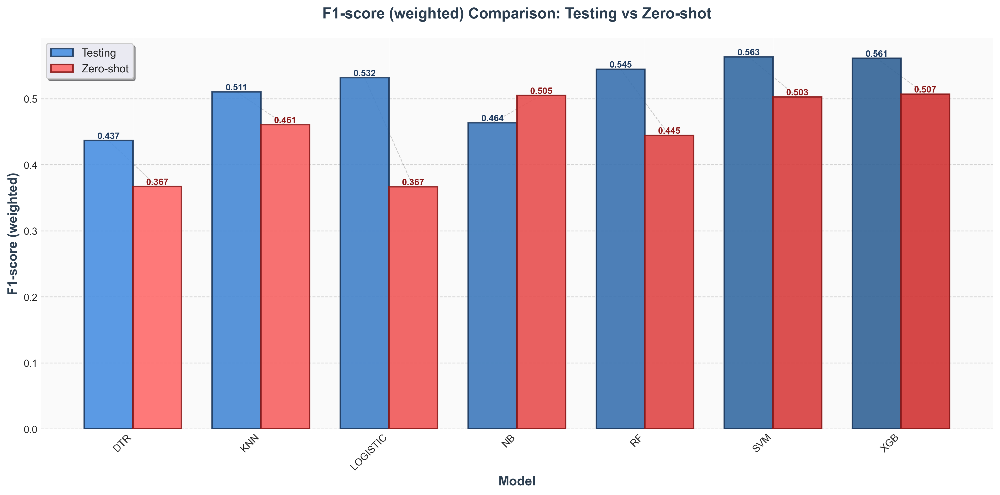

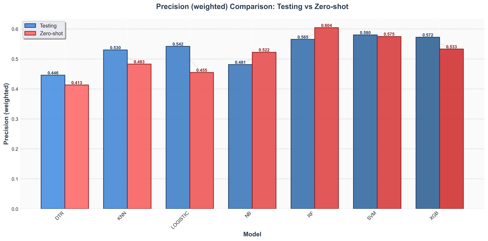

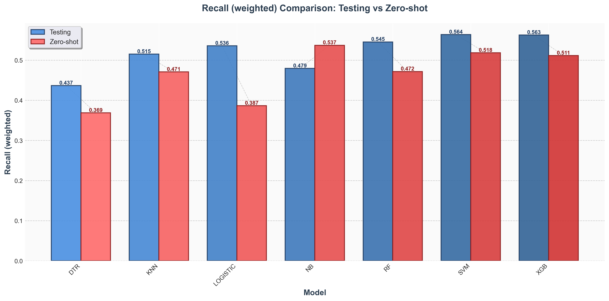

**Ανάλυση ανά Μοντέλο:**
*   **SVM & XGBoost:** Κατέχουν την πρώτη θέση (~56%). Το SVM δείχνει μια ελαφριά υπεροχή στο Precision, ενώ το XGBoost είναι αρκετά σταθερό. Η πτώση σε σχέση με το 80-20 είναι μικρή (~6%), αποδεικνύοντας ότι έχουν μάθει γενικεύσιμα χαρακτηριστικά.
*   **Random Forest:** Πλησιάζει αρκτά τους πρώτους. Τα ensembles (RF, XGB) είναι γενικά πιο ανθεκτικά σε αλλαγές ομιλητών.
*   **Logistic Regression:** Έπεσε στην 4η θέση. Φαίνεται πως οι διαφορές μεταξύ ομιλητών δεν είναι γραμμικά διαχωρίσιμες όσο εύκολα ήταν τα δείγματα του ίδιου ομιλητή.
*   **KNN, NB, DTR:** Παραμένουν στις τελευταίες θέσεις, με το DTR να είναι το πιο ακατάλληλο για speaker-independent εφαρμογές.

### 6.4 Σύγκριση workflows — AUC και ROC καμπύλες

Για κάθε workflow υπολογίστηκε η Macro AUC (one-vs-rest) και σχεδιάστηκαν οι macro-averaged ROC καμπύλες, που απεικονίζουν την ικανότητα διάκρισης μεταξύ κλάσεων ανεξάρτητα από το threshold.

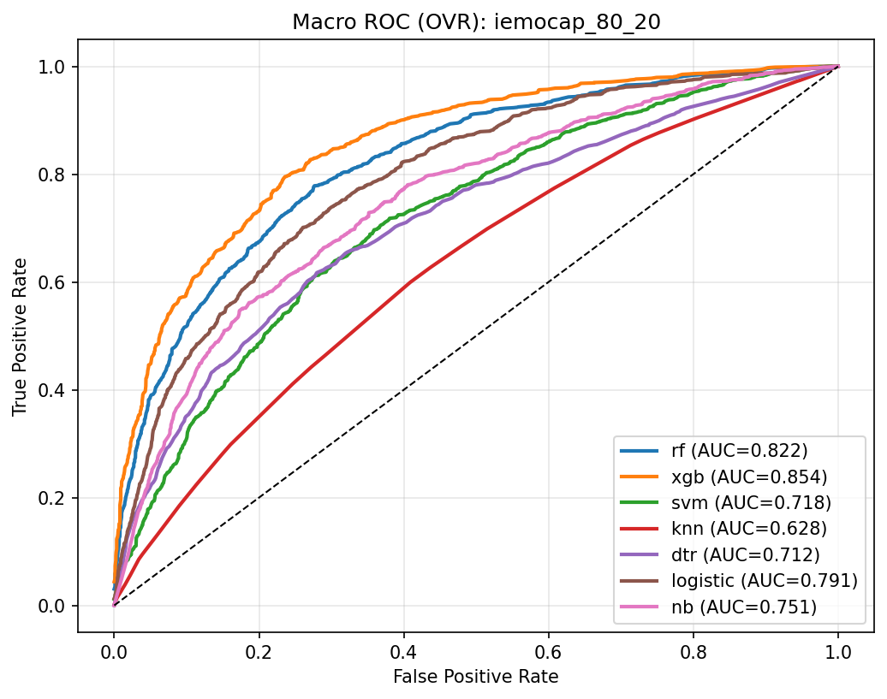

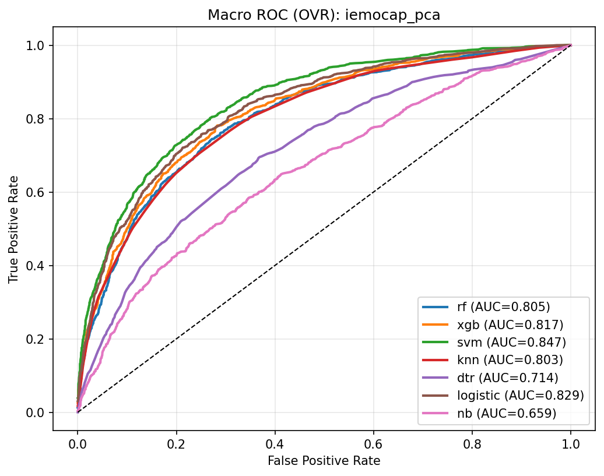

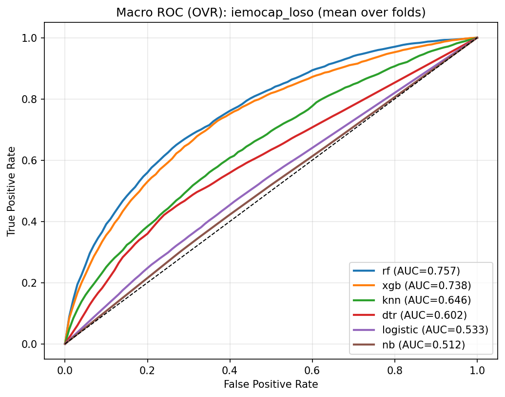

Στο 80-20 η καλύτερη AUC είναι του XGBoost (0.8542), στο LOSO του Random Forest (0.7572) και στο PCA του SVM (0.8466). Το SVM στο LOSO δεν αναφέρεται σε AUC διότι σε αυτό το setup δεν υπολογίζονται πιθανότητες. Η σύγκριση επιβεβαιώνει ότι στο χώρο των PCA components τα γραμμικά μοντέλα (Logistic, SVM) επιτυγχάνουν πολύ καλή διάκριση (AUC > 0.82), ενώ στο 80-20 με πλήρη χαρακτηριστικά ξεχωρίζουν τα ensemble (XGB, RF).

---

---

## 7. Γενίκευση σε νέο dataset (Zero-Shot σε CREMA-D)

Ο τελικός έλεγχος αξιολογεί την ικανότητα των μοντέλων να λειτουργούν σε άγνωστο dataset.

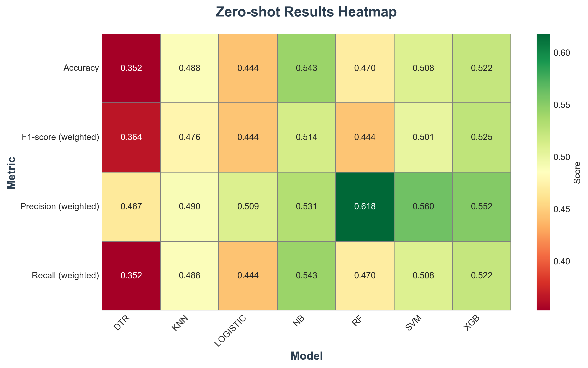

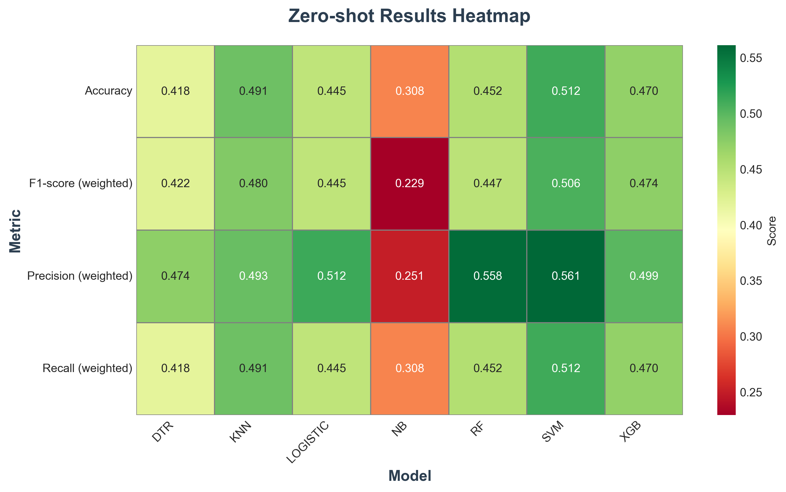

*   **Naive Bayes (54.29%): Κορυφαίο στο CREMA-D.** Ενώ ήταν από τους χειρότερους στο IEMOCAP, στο CREMA-D είχε τις καλύτερες επιδόσεις. Η απλότητά του λειτούργησε ως πλεονέκτημα, αποφεύγοντας το overfitting στις ιδιαιτερότητες του IEMOCAP.
*   **XGBoost (52.22%): Καλή απόδοση, αλλά επηρεάζεται από το domain shift.** Κράτησε καλή απόδοση, αλλά υπέφερε από το domain shift.
*   **SVM (50.82%): Πτώση σε σχέση με το IEMOCAP.** Έπεσε σημαντικά, δείχνοντας ότι τα "όρια" που έμαθε στο IEMOCAP δεν μεταφράζονται τέλεια στο CREMA-D.

## 8. Συμπεράσματα

1.  **Καλύτερο Μοντέλο Γενικής Χρήσης: Το XGBoost είναι το καλύτερο στο 80-20 και παραμένει πολύ κοντά στο κορυφαίο SVM στο LOSO. Στο Zero-Shot είναι 2ο μετά το Naive Bayes.**
2.  **Ρόλος του PCA: Βοηθά τα γραμμικά μοντέλα (SVM, Logistic Regression), αλλά μειώνει την απόδοση των δέντρων κατά ~4–6 μονάδες.**
3.  **Γενίκευση: Στα zero-shot σενάρια, απλούστερα μοντέλα μπορεί να υπερέχουν.**

---
